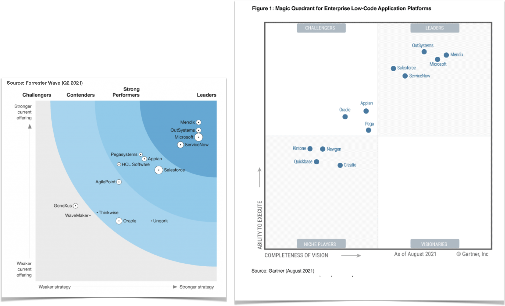
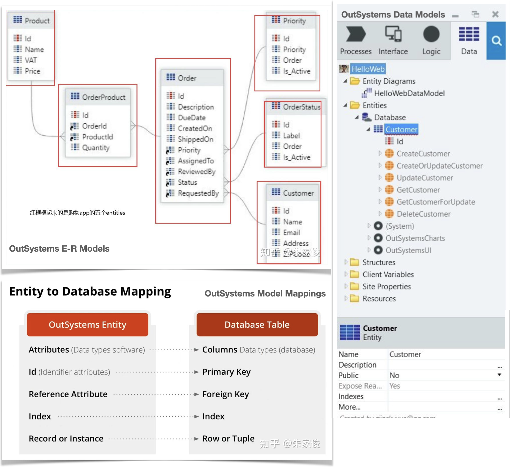
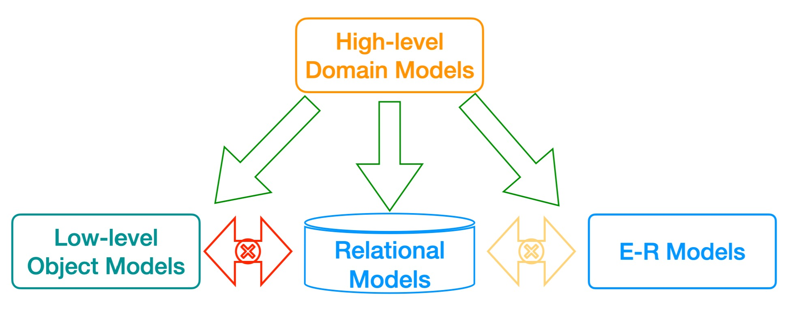
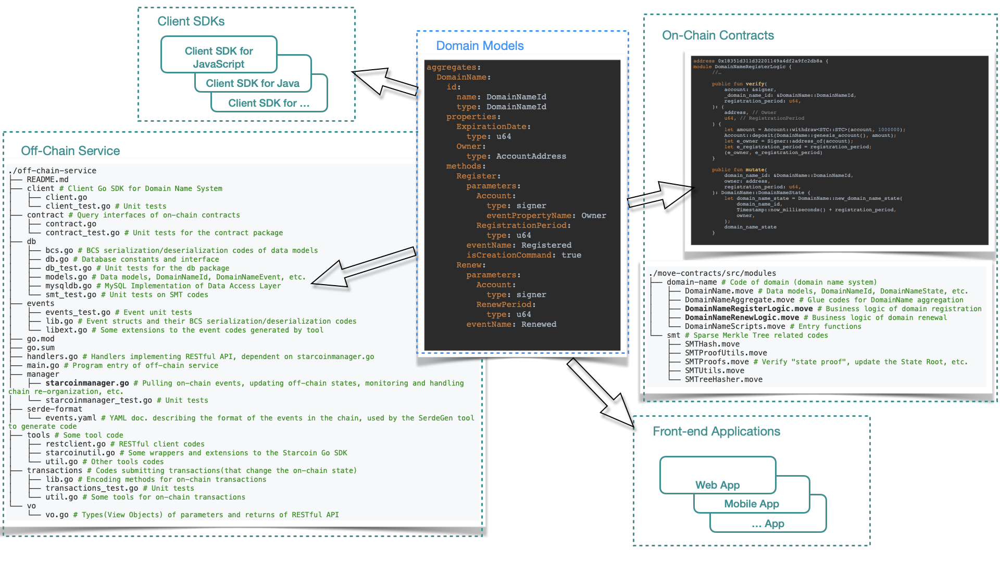
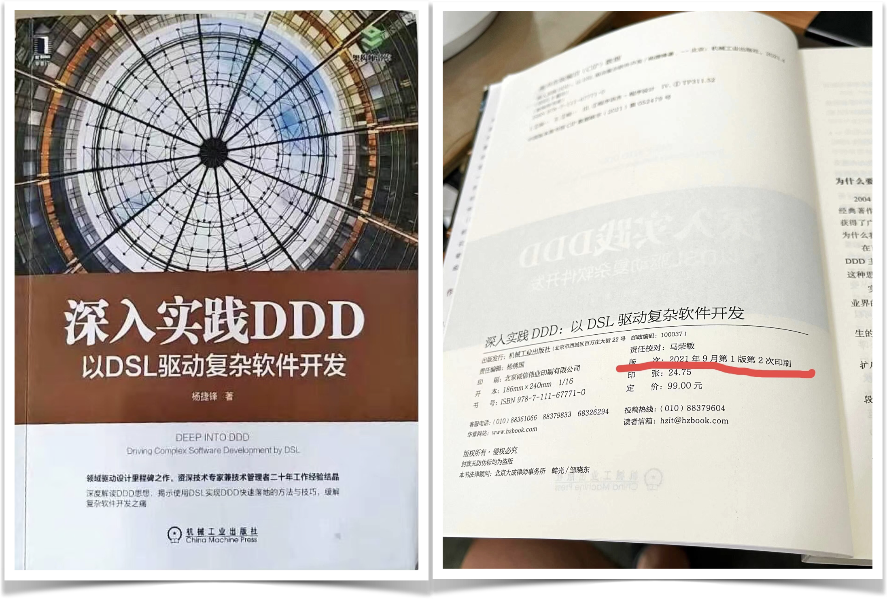
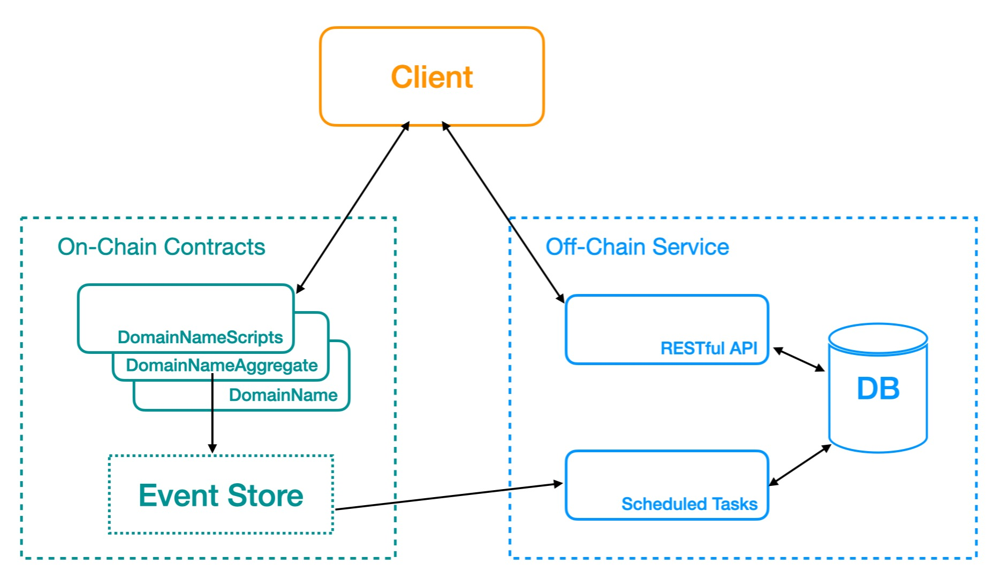

# A Dapp Low-Code Development Platform

English | [中文](README_CN.md)

[ToC]

## What we want to do

A **true** Low-code development platform(LCDP) that helps developers build decentralized applications(Dapps) that maximize the use of blockchains as technical infrastructure.

A low-code development platform that allows developers to build extremely complex decentralized applications with experiences that are very close to developing "traditional" applications.

In the initial phase, the platform will prioritize support for building Dapps running on the Move public blockchain.

In the longer term, the platform does not restrict developers to use any programming language to build Dapps, allowing them to focus on the implementation of the "business logic". Thus, developers of "traditional" applications can more easily enjoy the dividends of blockchain development; while "traditional" enterprise software and Web 2.0 Internet applications, which are already highly complex, can be migrated onto blockchains at low cost and become decentralized Web 3.0 applications.

## What is a "true" low-code development platform

"What is this 'true' low-code development platform you speak of?"

Here we think it is necessary to clarify the difference between "low-code" and "no-code". No-code refers more to a category of "end-user" oriented tools through which users can quickly assemble certain applications; for example, some Internet form tools, website building tools, etc. The low-code platform, on the other hand, we think is for professional developers.

We believe that a true low-code development platform should have the following key features.

* **Model driven** development. These models should ideally be "domain models" that are as far from "technology" and as close to "business" as possible. Because "communication" is the biggest cost in complex software development - even if the low-code platform is for developers and the "no-code" is for end users(business people).

* **Visual Development**. Visual modeling tools are an important part of the visual development toolbox for low-code platforms. However, it should be noted that if the modeling tool can save the model as a well-readable plain text, then the specification of this text is actually a DSL(domain-specific language), and such a DSL can actually be written manually by the developer(without the help of a visual modeling tool).

* Support the use of **expression languages**. An expression language should be simpler and easier to write business logic in than the general-purpose language(GPL). It should be functional programming style; it should be as declarative as possible - that is, for expressing "what is wanted" rather than "how it is done".

* **Systematic software engineering support**. The low-code platform should integrate best practices in the areas of software engineering including development, debug, testing, version control, DevOps, etc.

* **Applications are open to integration and are extensible**. Applications developed by low-code platforms should have open APIs as well as the ability to use external APIs and be extensible using general-purpose languages.

## Current state of low-code development platforms

When we look at traditional low-code development platforms for enterprise applications in the Web 2.0 era according to the above criteria for "true" low-code, there are relative leaders.

So, by the time of Web 3.0, the existing Dapp low-code platforms(if they exist at all), are there any very capable ones?

Unfortunately, by the rigorous "true" low-code criteria described above, we have not yet seen the existence of such a Dapp low-code platform.

"Is it so hard? Why don't they do it?"

### The “Model-driven” of enterprise application LCDPs

Traditional enterprise application development platforms(including low-code platforms) are basically "driven" by the E-R(Entity-Relationship) models and/or relational models(the models used in SQL databases).

For example, see how OutSystems does it?

OutSystems uses both E-R models and relational(data) models; some enterprise application development platforms use only one or the other.

There is a fairly direct correspondence between the concepts used by the E-R models and the relational models, so their modeling results(the generated codes) can easily run on the traditional enterprise software technology infrastructures - SQL databases.But it's hard for them to run on brand new technology infrastructures such as blockchains - where the dominant smart contract platforms and "decentralized ledgers" are constructed too far from traditional SQL databases.

Clearly, the development of a "true" low-code platform requires long-term accumulation of skills and experience, and the technology routes used in traditional enterprise application low-code platforms make them difficult to be ported to the entirely new space of Dapp development.

As for the existing Dapp "low-code" platforms, "They don't have those features, but then what does it matter?"

### The importance of core values

> Never forget the original intention, the only way to get to the end.

A platform's potential is determined by its "core values". The core features expected of a professional low-code platform, such as model-driven, expression language, have values that are difficult to replace with other solutions that try to "bypass" them.

For example, "configurable smart contract templates" certainly have the value of improving the efficiency of developers copying, pasting, and modifying "readymade codes" - if indeed There are "readymade codes". If a developer wants to make some innovative applications and there are no readymade "smart contract templates" available, then it won't be helpful; when multiple chains need to be supported, it is also a big burden for platform developers to write and maintain such a library of "smart contract templates" in different languages(Solidity, Move, etc.) for different chains. Moreover, "smart contracts" are often only the on-chain part of a application, and decentralized applications often require off-chain parts as well.

There is also the "expression language", and although it may be difficult to implement this feature perfectly(the implementation priority can be lower) - for example, it requires developing compilers to compile the codes written in this expression language into intermediate codes that can be executed by the virtual machines(EVM, MoveVM, etc.) of each chain - with it, developers can use only this "expression language" to write business logic, and the developed application can run directly on different chains. There is no need to learn and use each chain's programming language, which greatly saves the cost of application development and porting.

## Technology architecture overview

"Model-driven development" is the core feature of low-code development platforms.

As mentioned earlier, the traditional models used by low-code platforms for enterprise applications are relational and/or ER models; We choose the DDD([Domain-Driven Design](https://en.wikipedia.org/wiki/Domain-driven_design)) style domain models, which makes our platform so unique and powerful.

### The key is the modeling paradigm

The DDD domain models are OO(object-oriented) models in a relatively high level of abstraction.

Mapping from the higher abstraction level DDD domain models to the lower abstraction level implementation object models(OO is the dominant paradigm for programming languages), relational models(the dominant paradigm for database models), etc. is relatively easy and can often be done by automated tools.

Mapping low-level models to each other is relatively difficult and often requires developers to step in and even write a lot of implementation codes.
Developers familiar with the ORM(Object-Relational Mapping) frameworks can easily understand this.

### Domain models as the core

The idea is that there should be a domain modeling language that can be used to accurately describe key concepts in the domain; the domain models described by this language can be used as the basis for communication across the application development team(both technical and domain experts) and should be conveniently mapped to the code implementation of the application.

This language should be a DSL that can be adopted by visualization tools as well as easy for humans to read and write.

With the domain model described by this DSL as the core, we make a tool chain to generate implementation codes for various parts of the application from the model and then run the application on various technical infrastructures.

### Domain-Driven Design Modeling Language(DDDML)

The question is whether we can find such a language as described above?

Fortunately we have found it - DDDML(Domain-Driven Design Modeling Language); more precisely, we invented it.

Eric Evans, founder of Domain-Driven Design, has said that he has always believed that DSL is the next big step in the evolution of domain-driven design.

DDDML takes this big solid step forward. You will see this in what follows.

## Who we are

"Theoretically you are all right, but why can you do it?"

Because, "using DDD-style domain models to drive development" is really the thing we've done in the Web 2.0 era!

Even when implementing a low-code platform for developing traditional enterprise applications, using DDD-style domain models to drive development is a very bold and innovative move. But the path is through, we have had a lot of valuable experience accumulated. We even published a thick monograph to share the lessons learned with developers.

Here it is necessary to highlight the architect of our project: Jiefeng Yang.

Mr. Yang has more than 20 years of software development experience, and is a well-deserved DDD expert, the creator of DDDML, and the author of the technical book "[Deep into DDD: Driving Complex Software Development by DSL](https://item.jd.com/12834017.html)".

It is in the book "Deep into DDD" that we details the design of DDDML, the native DSL for DDD, and its related development tool chain, and how to use them to solve various aches in complex software development process. This well-received bestseller was published in April 2021 and reprinted in September of the same year.

That is, we have completed the construction of a complete theoretical system of key technologies that we have successfully put into practice; more than that, we have done a preliminary proof of concept on how to apply these experiences to the development of Dapps - as we will demonstrate in a demo system below.

## Proof of concept: a demo domain name system

###  The purpose of the demo

In the grand scheme of things, we are actually trying to explore a development model that would significantly lower the barrier for traditional application developers to enter the Dapp space. The ideal "very low barrier" would be something like this: developers would only need to build domain models and write(pure) business logic codes. These codes should be able to migrate between different technical infrastructures such as L1 blockchain/L2 blockchain, on-chain/off-chain, centralized database/decentralized ledgers, etc. without requiring developers to manually modify them.

This is obviously a very challenging goal. Because different blockchains have different characteristics, can our low-code platform be designed to effectively meet the challenges posed by the diversity of technical infrastructures? We certainly have great confidence in this, and we will demonstrate this by developing a demo domain system.

We know that Move(Move VM) did not have a data structure like Solidity(EVM)'s `Mapping` before; even if Move will support `Table`(`Mapping`) next, it should not be abused.

The abuse of Mapping can cause the so-called blockchain state explosion problem. It is not a recommended practice to store large amounts of state data in Mapping on the L1 chain; they should be stored off-chain(outside the L1 chain), but at the same time they need to be verifiable and usable on-chain.

So, building a domain name system on a Move chain without using `Table`(`Mapping`) is a development task of considerable complexity; next we can see the DDD and DSL-based development pattern(a low-code platform) can greatly reduce the burden of developers to complete this task.

### How to prove it

In the first step(already done), we manually write the codes for the implementation of this demo application; which should be decoupled into three parts as follows.

1. libraries that can be reused and are independent of the business logic of the application domain(the domain name system).
2. boilerplate codes that can be generated from the models(described by the DSL).
3. pure business logic codes. It should be noted that the business logic of this demo is written in Move and executed on the Move blockchain(Starcoin L1), but there is potential to evolve a more complex implementation based on this. 

In the second step(to be completed), we will create code generation tools to templatize the codes in part 2 above. We can then remove the part 2 codes described above, regenerate these codes from the models(plus the code templates), and the application should compile and run properly.

It should be noted that although we have not yet completed the second step, any experienced developer can conclude with certainty by reading the source codes we completed in the first step: the real business logic codes(which do need to be written by developers) are very limited, and 90% of the source codes are boilerplate codes that can be generated from the models.

#### Source code of the demo

The source code for the demo is available here [GitHub repository](https://github.com/wubuku/StarcoinNSDemo).

### Features of the demo domain name system

To make the proof of concept in the limited time available, we have dreamed up some simple but "enough to make the point" feature requirements for the domain name system as follows.

* Support domain name registration and renewal. Submitting a domain name registration transaction requires a Non-Membership Proof of domain name state to be input to the contract on the chain; submitting a renewal transaction requires a Membership Proof of domain name state to be input.

* Only second-level domains need to be supported. This is to demonstrate the case where the entity ID is not a "primitive type", but a "complex" value object with two fields.

### Architecture of the demo system

The demo domain system consists of three parts.

- Client. Before submitting a transaction to the on-chain contracts, the client requests the off-chain service to get the state of the entity(domain name) and its proof of state.
- On-chain contracts. The on-chain contracts do not store the "current state" of all domain names, but only the SMT Root of all domain names. when the on-chain contract executes a transaction, it first verifies the state and the proof of state submitted by the client, and then executes the business logic and updates the SMT Root.
- Off-chain service. The off-chain service constructs the "current state" of all domains in the local database by pulling events from the chain. Anyone can run an instance of the off-chain service and cannot do evil(falsify state information), which ensures the decentralization of the system.

### Portability of the demo system

Although we used the Move language(based on the Starcoin chain) for the proof-of-concept, it shows that it is also possible to use Solidity(based on Ethereum or other EVM-compatible chains), since Solidity also supports `struct` and Ethereum also provides event/log mechanisms. That is, the features of the Move language and the Starcoin chain that this proof-of-concept demo utilizes are also available on Ethereum.

## Key risks

TBD...

