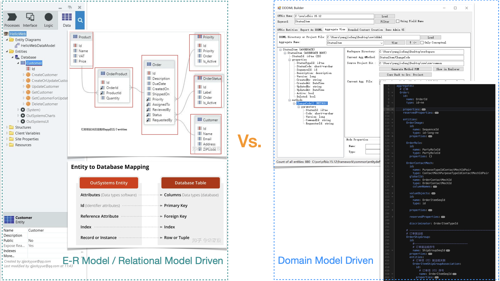

# 一个 Dapp 低代码开发平台

[English](README.md) | 中文

[ToC]

## 我们想要做什么

一个**真正的**低代码开发平台（Low-code development platform，LCDP），让开发者可以极接近开发“传统”应用的体验，高效地构建极复杂的去中心化应用（Dapp）。

一个低代码开发平台，帮助开发者构建最大化地使用区块链作为技术基础设施的去中心化应用。

我们知道事情不能一蹴而就。在起步阶段，这个平台会优先支持构建运行在 Move 公链上 Dapp。

更长远的目标，平台不限制开发者使用何种编程语言去构建 Dapp，让开发者可以专注于“业务逻辑”的实现。于是“传统”应用的开发者也可以更便捷地享受到区块链发展的红利；而当前已经高度复杂的“传统”企业软件和 Web 2.0 互联网应用可以低成本地迁移到链上，成为去中心化的 Web 3.0 应用。

### 何谓“真正的”低代码开发平台

“你们所说的‘真正的’低代码开发平台是什么？”

这里我们认为有必要澄清“低代码”和“无代码”的区别。无代码更多地是指一类面向“最终用户”的工具，通过这些工具，用户能够快速地组装出一些应用来。比如一些互联网表单工具、建站工具等。而低代码平台，我们认为是面向专业开发人员的。

我们认为真正的低代码开发平台应该具备以下关键特性：

* **模型驱动**开发。这个模型最好是尽可能离“技术”远、离“业务”近的“领域模型”。因为“沟通”是复杂软件开发中最大的成本——即使低代码平台是面向开发者的，“无代码”是面向最终用户（业务人员）的。

* **可视化开发**。可视化建模工具是低代码平台可视化开发工具箱的重要组成部分。不过，需要指出的是，如果建模工具可以将模型保存为可读性良好的纯文本，那么这个文本的规范其实就是一门 DSL（领域专门语言），这样的 DSL 其实开发人员是可以手写（不需要借助可视化建模工具）。

* 支持**表达式语言**的使用。表达式语言应该比通用编程语言（GPL）更简单，更易于编写业务逻辑。它应该是函数式的；它应该尽可能是声明式的——即用于表达“想要什么”而非“怎么做”。

* **系统的软件工程支持**。低代码平台应该集成开发、Debug、测试、版本控制、DevOps 等软件工程领域的最佳实践。

* **开放集成并且可扩展**。代码平台开发的应用应该具有开放的 API 以及可以使用外部的 API，并且能使用通用编程语言进行扩展。

在我们看来，“真正的”低代码平台在去中心化世界中尚未诞生，一切有待我们去创造。

## 对 Move 区块链生态的价值主张

我们热爱 Move 语言“面向资源编程”这一革命性的创新。我们认为资源的可组合性可以大大加快 Move 生态创新的速度，从而更有可能催生出在其他公链上从未有过的杀手级应用。

但是不管怎么说，今日想要开发一个稍微复杂一点的 Dapp，即使是链上的部分（智能合约）使用了 Move 语言，其总体开发效率也实在让人难称满意。

另一方面，低代码开发平台对于开发“传统”应用的价值已经得到充分的验证和广泛的认可。很多“传统”应用的开发者已经建立了对各领域的深刻认知，也不乏软件开发经验，他们渴望尽快在去中心化世界中发挥他们的才华和智慧。

我们尤其想要强调的是低代码平台与 DAO 结合产生的巨大的想象空间。DAO 作为存在于区块链世界的“法人”，必然要求其将更多的“业务活动”上链。DAO 的发展会放大对区块链“业务软件”的需求。去中心化版本的“业务软件”亟需降低开发成本和提升开发效率。传统的低代码平台本来就特别适合于快速开发传统的“企业级应用”，我们相信到了 Web3 时代亦会如此。

## 低代码开发平台的现状

按照上述维度去衡量传统的 Web 2.0 时代的企业应用低代码开发平台，是存在相对出色的领导者的。


那么，到了 Web 3.0 时代，现有的 Dapp 低代码平台，有没有很能打的呢？

不幸的是，按照上述严格的 "真正的 "低代码标准，我们还没有看到这样一个Dapp低代码平台的存在......

“很难吗？为什它们没有做到？”

### 企业应用低代码平台的“模型驱动”

传统企业软件开发平台（包括低代码平台）基本都是采用 ER（实体关系）模型 and/or 关系模型（SQL 数据库采用的模型）来“驱动”开发。

比如，看看 OutSystems 怎么做的？


OutSystems 既使用了 ER 模型也使用了关系（数据）模型；有的企业软件开发平台只使用其中的一种。

ER 模型和关系模型使用的概念之间有很直接的对应关系，所以它们的建模结果（产生的代码）很容易跑在传统的企业软件技术基础设施——SQL 数据库上。但是它们很难跑在区块链这样的全新的技术基础设施上——主流的智能合约和“去中心化账本”的构造和传统的 SQL 数据库实在相差太远。

显然，开发一个“真正的”低代码平台需要长期的技术和经验的积累，而传统企业应用低代码平台所采用的技术路线，导致它们很难被移植到 Dapp 开发这个全新的领域。

至于已有的 Dapp “低代码”平台，“它们是没有这些特性，但是这又有什么关系？”

### 核心价值观的重要性

开发一个真正的低代码平台——尤其是坚持“模型驱动”——无疑是一条艰难的路。已有的 Dapp“低代码”平台的问题是他们总想“抄捷径”。

> 不忘初心，方得始终。

一个平台的潜力是由它的“内核”决定的。专业低代码平台所应具备的核心特性，比如模型驱动、表达式语言，都具有其他试图“绕过”的解决方案难以替代的价值。

比如说，“可配置的智能合约模板”当然也有它的价值，就是提升了开发人员拷贝、粘贴、修改“现成代码”的效率——前提是确实存在“现成代码”。如果开发者想要做一些创新性的应用，没有现成的“智能合约模板”可用，那么它就没法帮助到开发者；需要支持“多链”时，平台方开发人员编写和维护这样的“智能合约模板”库也是很大的负担，需要使用不同的语言（Solidity、Move 等）为不同的链编写不同的模板。“智能合约”往往只是应用的链上（On-Chain）部分，去中心化应用往往还需要链下（Off-Chain）部分的开发。

还有“表达式语言”，虽然想要较完美地实现这个特性可能是复杂的（实现的优先级可以低一些）——比如需要开发编译器将以这种表达式语言编写的代码编译为各个链的虚拟机（EVM、MoveVM 等）可以执行的指令，但是有了它，开发者就可以仅使用这门“表达式语言”编写业务逻辑，开发出来的应用直接可以运行在不同的链上。不需要去学习和使用各个链的开发语言，这大大节约了应用的开发和移植成本。

## 技术架构

“模型驱动开发”是低代码开发平台最核心的特性。

正如前面所说，传统的企业应用低代码平台采用的建模范式是关系模型以及/或者 ER 模型；我们选择构建 DDD（[Domain-Driven Design](https://en.wikipedia.org/wiki/Domain-driven_design)）风格的领域模型，这使得我们的平台如此独特和强大。

### 关键是建模范式

DDD 领域模型是一种抽象层次相对较高的 OO（面向对象）模型。


从抽象层次较高的 DDD 领域模型映射到抽象层次较低的编程语言对象模型（OO 是编程语言的主流范式）、关系模型（数据库的主流范式）等是比较容易的，往往自动化工具就能完成。

低层次模型之间的相互映射是相对困难的，往往需要开发人员介入甚至编写大量的实现代码。熟悉 ORM（对象关系映射）框架的开发人员很容易理解这点。

### 以领域模型为核心

我们的想法是，应该有一种领域建模语言，可以用来精确描述领域中的关键概念；这种语言描述的领域模型可以作为整个应用开发团队（包括技术人员和领域专家）沟通的基础，并且应该可以很方便地映射到应用的代码实现。

这种语言应该是一种 DSL，既可以被可视化工具采用，也方便人类阅读和编写。

以这种 DSL 描述的领域模型为核心，我们制造一个工具链，从模型生成应用的各个部分的实现代码，然后在各种技术基础设施上运行应用。


#### 领域驱动设计建模语言（DDDML）

问题是我们是否可以找到上面所说的这样一种语言？

幸运的是我们已经找到了它——DDDML（领域驱动设计建模语言）；更确切地说，是我们发明了它。

Domain-Driven Design 的创始人 Eric Evans 曾经说过，他一直深信 DSL 会是领域驱动设计发展的下一大步。

DDDML（领域驱动设计建模语言）迈出了坚实的这一大步。在接下来的内容中，你会看到这一点。

## 我们是谁

“理论上说的都对，可是为什么你们可以做到？”

因为，“使用 DDD 风格的领域模型驱动开发”，这是我们在 Web 2.0 时代真的做过的事情！



即使是实现一个开发传统企业应用的低代码平台，使用 DDD 风格的领域模型来驱动开发都是非常大胆和创新的尝试。但是这个路子是通的，我们有过很多宝贵的经验积累。我们甚至出版了一本厚厚的专著来向开发人员分享其中经验。

我们项目的架构师是杨捷锋。他有超过二十年的软件开发经验，DDD 专家，DDDML 的创造者，技术图书[《深入实践 DDD：以 DSL 驱动复杂软件开发》](https://item.jd.com/12834017.html)的作者。同时，他还是第一个 Move 公链 Starcoin 上几个重要的生态基础项目的开发者，或者为它们提供了关键技术支持（Starcoin 上一些生态项目由匿名团队开发）。 

正是在《深入实践 DDD》一书中，我们详细阐述了 DDDML 这一 DDD 原生 DSL 及其相关开发工具链的设计，以及如何使用它们解决复杂软件开发过程中的各种痛点。这本深受好评的技术畅销书于 2021 年 4 月出版，当年 9 月重印。


也就是说，我们已经完成了关键的技术理论体系的构建，并曾将其成功付诸于实践；不止如此，怎么把这些经验用于开发 Dapp，对此我们做了初步的概念验证——下面我们会通过一个演示性的系统证明这一点。

## 概念验证：一个演示性的域名系统

### Demo 的目的

从大的方面说，我们其实试图探讨一种可以极大地降低传统应用开发者迈入 Dapp 领域的门槛的开发模式。理想中的“极低门槛”应该是这样的：开发人员只需要构建领域模型，编写（存粹的）业务逻辑代码。这些代码理应可以在 L1/L2、链上/链下、中心化数据库/去中心化账本等不同的技术基础设施之间迁徙而不需要开发人员手动修改。

这显然是一个极具挑战性的目标。因为不同的区块链有不同的特性，我们的低代码平台的设计是否可以有效地应对基础设施的多样性所带来的挑战？对此我们当然是有极大的信心的，我们将通过开发一个 Demo 域名系统来证明这一点。

我们知道，之前 Move（Move 虚拟机）没有类似 Solidity（以太坊虚拟机）的 Mapping 这样的数据结构；就算接下来 Move 会支持 Table（Mapping），它也不应该被滥用。

因为对 Mapping 的滥用会造成所谓的区块链状态膨胀的问题。在 L1 链上的 Mapping 中存储大量的状态数据不是一个值得推荐的实践，它们应该存储在链下（或者说 L1 链外），但同时这些数据又需要在链上可以被验证和使用。

所以，在不使用 Table（Mapping）的前提下，在 Move 链上构建一个域名系统是一件具有相当复杂度的开发工作；接下来我们可以看到基于 DDD 和 DSL 的开发模式（低代码平台）可以如何极大地减轻开发者完成这项工作的负担。


### 如何证明

第一步，我们手动编写这个 Demo 应用的实现代码（已完成）；它们应该解耦为如下三部分：

1. 可以重用的和应用领域（域名系统）的业务逻辑无关的库。
2. 可以从（DSL 描述的）模型生成的样板代码（boilerplate code）。
3. 纯粹的业务逻辑代码。需要说明的是，这个 Demo 的业务逻辑是使用 Move 编写、在 Starcoin链（L1）上执行的，但在此基础上很有潜力演化出更复杂的实现。 

第二步，我们制作代码生成工具，把上面的第 2 部分代码模板化（待完成）。然后，我们可以删除上面所说的第 2 部分代码，使用模型（加上代码模板）重新生成这部分代码，应用应该可以正常编译和运行。

需要说明的是，尽管我们还没有完成第二步，但是任何有经验的开发人员都可以通过阅读我们在第一步完成的源代码得到肯定的结论：真正的业务逻辑代码（它们确实需要开发人员编写）非常有限，源代码中的 90% 都是可以从模型生成的样板代码。

#### Demo 的源代码

Demo 的源代码见此 [GitHub 仓库](https://github.com/wubuku/StarcoinNSDemo)。


### “域名系统”的功能

为便于在有限的时间内完成概念验证，我们生造一些简单但基本可以说明问题的“域名系统”的功能需求如下：

* 支持域名的注册与续费。提交域名注册的交易需要传入域名状态的不存在证明（Non-Membership Proof）；提交续费域名的交易需要传入域名状态的存在证明（Membership Proof）。

* 只需要支持二级域名。这是为了演示实体 ID 不是一个“基本类型”，而是有两个字段的“复杂”值对象的情况。

### Demo 系统的架构

Demo 域名系统由三部分组成：


- 客户端。客户端向链上合约提交交易前，先向链下服务请求获取实体（域名）的状态以及其状态证明。
- 链上合约。链上合约不保存所有域名的“当前状态”，只保存着所有域名状态的SMT Root。链上合约执行交易时，先验证客户端提交过来的状态和状态证明，然后再执行业务逻辑、更新 SMT Root。
- 链下服务。链下服务通过从链上拉取事件，在本地数据库中构建出所有域名的“当前状态”。任何人都可以运行链下服务的实例，且无法作恶（伪造状态信息），这就保证了系统的去中心化。

需要说明的是，Demo 系统的实现代码实际上使用了 Starcoin 二层/分层方案中提到的富状态交易（StateFullTransaction） 模式。那么，如何确定交易（Transaction）涉及的状态（State）的边界，DDD 的“聚合”概念是一个非常强大的思维武器。

### 需要开发者手动完成的工作

首先我们需要开发者使用 DSL（DDDML）描述 Demo 系统的领域模型。

这一步得到的领域模型可能如下：

```yaml
aggregates:
  DomainName:
    id:
      name: DomainNameId
      type: DomainNameId
    properties:
      ExpirationDate:
        type: u64
      Owner:
        type: AccountAddress
    methods:
      Register:
        parameters:
          Account:
            type: signer
            eventPropertyName: Owner
          RegistrationPeriod:
            type: u64
        eventName: Registered
        isCreationCommand: true
      Renew:
        parameters:
          Account:
            type: signer
          RenewPeriod:
            type: u64
        eventName: Renewed
        
valueObjects:
  DomainNameId:
    properties:
      TopLevelDomain: # TLD
        type: string
      SecondLevelDomain: # SLD
        type: string
```

- DomainNameId：一个描述域名 ID 的值对象。

- DomainName：一个表示“域名”的聚合，聚合内只有一个同名的聚合根实体（DomainName），它有两个方法：

- - Register，注册域名的方法。
  - Renew，域名续费的方法。

然后，开发者需要编写链上合约中的业务逻辑代码。

这个 Demo 系统的链上合约代码的目录和文件结构如下：

```txt
./move-contracts/src/modules
├── domain-name # 领域（域名系统）相关代码
│   ├── DomainName.move # 数据模型，DomainNameId、DomainNameState 等
│   ├── DomainNameAggregate.move # “域名”聚合的粘合代码
│   ├── DomainNameRegisterLogic.move # 注册域名的业务逻辑
│   ├── DomainNameRenewLogic.move # 域名续费的业务逻辑
│   └── DomainNameScripts.move # 脚本（script）函数入口
└── smt # Sparse Merkle Tree 相关代码，用于验证交易传入的状态证明
    ├── SMTHash.move
    ├── SMTProofUtils.move
    ├── SMTProofs.move # 对证明（Proof）进行验证的方法
    ├── SMTUtils.move
    └── SMTreeHasher.move
```

这里需要特别说明的是，如果有代码生成工具，应该只有这两个文件是需要开发人员手动编写的“业务逻辑”代码：

* DomainNameRegisterLogic.move
* DomainNameRenewLogic.move

除此之外的其他代码都是可以重用的库（smt 目录中的代码），或者是可以由（DSL描述的）模型生成的代码。

我们需要开发人员手写“注册域名”的业务逻辑（Move 代码）大致如下：

```Move
address 0x18351d311d32201149a4df2a9fc2db8a {
module DomainNameRegisterLogic {
//…

public fun verify(
    account: &signer,
    _domain_name_id: &DomainName::DomainNameId,
    registration_period: u64,
): (
    address, // Owner
    u64, // RegistrationPeriod
) {
    let amount = Account::withdraw<STC::STC>(account, 1000000);
    Account::deposit(DomainName::genesis_account(), amount);
    let e_owner = Signer::address_of(account);
    let e_registration_period = registration_period;
    (e_owner, e_registration_period)
}

public fun mutate(
    domain_name_id: &DomainName::DomainNameId,
    owner: address,
    registration_period: u64,
): DomainName::DomainNameState {
    let domain_name_state = DomainName::new_domain_name_state(
        domain_name_id,
        Timestamp::now_milliseconds() + registration_period,
        owner,
    );
    domain_name_state
}
```

* verify 函数验证客户端提交的交易参数，如果验证通过，返回“事件”的属性。事件会被 DomainNameAggregate emit 出来（使用“廉价”的链上事件存储而不是昂贵的状态存储）。
* mutate 应该是个纯函数，接受事件参数，返回“修改”后的（这里指新创建的）域名状态。

需要开发人员手写“域名续费”的业务逻辑大致如下：

```Move
address 0x18351d311d32201149a4df2a9fc2db8a {
module DomainNameRenewLogic {
//…

public fun verify(
    account: &signer,
    _domain_name_state: &DomainName::DomainNameState,
    renew_period: u64,
): (
    address, // Account
    u64, // RenewPeriod
) {
    let amount = Account::withdraw<STC::STC>(account, 1000000);
    Account::deposit(DomainName::genesis_account(), amount);
    let e_account = Signer::address_of(account);
    let e_renew_period = renew_period;
    (e_account, e_renew_period)
}

public fun mutate(
    domain_name_state: &DomainName::DomainNameState,
    _account: address,
    renew_period: u64,
): DomainName::DomainNameState {
    let updated_domain_name_state = DomainName::new_domain_name_state(
        &DomainName::get_domain_name_state_domain_name_id(domain_name_state),
        DomainName::get_domain_name_state_expiration_date(domain_name_state) + renew_period,
        DomainName::get_domain_name_state_owner(domain_name_state),
    );
    updated_domain_name_state
}
```

* 与域名注册的两个函数相比这两个函数有一点区别。由于域名续费是对一个已有的域名执行续费，所以在输入参数列表中有表示旧状态的参数。
* mutate 方法接收旧状态和事件数据并返回新状态。

---

以上，就是**所有**需要手写的代码：一个模型文件、两个业务逻辑代码文件！

### 应该由工具自动完成的工作

#### 链下服务的代码

Demo 系统的链下服务的代码是使用 Go 编写的。项目的目录和文件结构见下：

```txt
./off-chain-service
├── README.md
├── client # 域名系统的 Client SDK for Go
│   ├── client.go
│   └── client_test.go # 单元测试代码
├── contract # 链上合约的查询接口
│   ├── contract.go
│   └── contract_test.go # contract 包的单元测试代码
├── db
│   ├── bcs.go # 数据模型的 BCS 序列化/反序列化代码
│   ├── db.go # 数据库常量和接口代码
│   ├── db_test.go # db 包的单元测试代码
│   ├── models.go # 数据模型，DomainNameId、DomainNameEvent 等
│   ├── mysqldb.go # 数据访问层的 MySQL 实现
│   └── smt_test.go # 关于 SMT 的单元测试代码
├── events
│   ├── events_test.go # 单元测试代码
│   ├── lib.go # 从 serde-format/events.yaml 生成的事件结构和 BCS 序列化/反序列化代码
│   └── libext.go # 对 SerdeGen 工具生成的事件代码做的一些扩展
├── go.mod
├── go.sum
├── handlers.go # 使用 Gin 实现 RESTful API 的 handlers，依赖 starcoinmanager.go
├── main.go # 链下服务的程序入口
├── manager
│   ├── starcoinmanager.go # 拉取链上事件、更新链下状态，监控和处理链的分叉等
│   └── starcoinmanager_test.go # 单元测试代码
├── serde-format
│   └── events.yaml # 描述链上事件的格式的 YAML 文档，SerdeGen 工具可使用它们生成代码
├── tools # 一些工具类代码
│   ├── restclient.go # REST client 代码
│   ├── starcoinutil.go # 对 Starcoin Go SDK 做的一些包装和扩展
│   └── util.go # 其他工具类代码
├── transactions # （改变链上状态的）链上交易相关的代码
│   ├── lib.go # （改变链上状态的）链上交易的编码方法
│   ├── transactions_test.go # 单元测试代码
│   └── util.go # 一些关于链上交易的工具代码
└── vo
    └── vo.go # RESTful API 使用的参数和返回值的类型（View Objects）
```

- 定时任务和 RESTful API 的实现可以从这里看起： starcoinmanager.go
- 仔细审视这些代码，我们可以发现：**所有**（整个链下服务的）代码其实都是可以由模型（DSL）生成的。

#### 各种客户端 SDK、前端应用以及更多

毫无疑问，我们完全可以制造自动化的工具，从 DDD 领域模型生成各种语言的 Client SDK，包括 Java Client SDK、JavaScript Client SDK、Go Client SDK，任意你能想到的编程语言的 Client SDK。

工具甚至能直接从领域模型生成有用户界面的前端应用，包括 Web 前端应用（这个在 Web 2.0 时代我们真的做过）、手机 App、命令行客户端应用等。也许你觉得这过于乐观，那么，最少你可以相信生成前端应用的脚手架代码是毫无问题的。

#### Demo 的代码行数

我们对这个 Demo 系统的代码行数做了一个粗略的统计如下：

```txt
github.com/AlDanial/cloc v 1.92  T=0.08 s (604.0 files/s, 97263.5 lines/s)
-------------------------------------------------------------------------------
Language                     files          blank        comment           code
-------------------------------------------------------------------------------
Go                              24            459            390           4374
Move                            12            255            225           1323
JSON                             3              0              0            509
Markdown                         2             58              0            211
XML                              5              0              0            118
YAML                             2              5              0             66
TOML                             2             24              0             34
-------------------------------------------------------------------------------
SUM:                            50            801            615           6635
-------------------------------------------------------------------------------
```

### Demo 的结论

通过这个 Demo，我们可以得出大致结论如下：

* Demo 揭示了我们提倡的低代码开发模式可以高效地开发运行在不同的链上的 Dapp。虽然我们是使用 Move 语言（基于 Starcoin 链）进行的验证，但说明使用 Solidity（基于以太坊或其他 EVM 兼容链）也是可行的，因为 Solidity 也同样支持结构体，以太坊同样支持事件/日志机制。也就是说，这个概念验证的 demo 所利用的 Move 语言和 Starcoin 链的特性，在以太坊上都有。
* “低代码”可以很好地屏蔽技术基础设施使用的复杂性。Demo 为了解决状态膨胀问题，把状态存储在链下（在 L1 链之外），这是一个比较复杂的架构，但是应用的开发者只需要编写业务逻辑，完全不需要感知其中的复杂性。
* “低代码”对 Dapp 开发效率的提升令人惊叹。将“低代码”开发运用在适当的地方，开发效率可以提升十倍以上。以 Demo 系统为例，整个项目的代码量有数千行，但是（等有了低代码平台的帮助后）开发人员需要手动编写的代码不过两三百行。

需要说明的是，Demo 其实没有完全展示出低代码开发的威力。我们可以借助 DSL（DDDML）的表现力，构建相当复杂的领域（对象）模型：值对象（非基本类型）嵌套值对象；包含多个（多级）实体的聚合等。在真实的“传统”应用的开发中，我们使用 DSL 构建过比 Demo 要复杂得多的聚合对象模型。

## 交付成果

这无疑是个雄心勃勃的项目，但是目前讨论太过长远的计划并没有太大的意义，我们这里先为项目设置两个小小的里程碑。

### 第一阶段

我们会创造一个命令行工具或者工具集。工具最少可以帮助开发者从领域模型生成链上的 Move 合约（Dapp 的链上部分）、链下服务（使用 Java 或 Go 语言编写），甚至生成更多的东西，比如 JavaScript Client SDK、有用户界面的 Web 前端应用的脚手架代码等。 

预计项目启动后，两个人工作三个月，可以达到这个里程碑。

### 第二阶段

我们会把第一阶段创造的命令行工具的功能搬到云端，开发者只需要打开浏览器就可以使用。我们预计会提供一个简单的 Web IDE，供开发者编写领域模型代码、一键生成 Dapp 应用，编写业务逻辑代码，将应用部署到云端的测试环境。

预计在到达第一个里程碑后，两个人工作三个月，可以达到这第二个里程碑。
